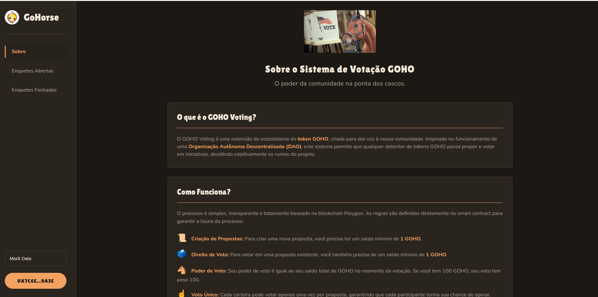

# Sistema de votação GOHO

Projeto que visa extender o [ecosistema do token GOHO](https://goho-view.vercel.app/docs) por meio da criação de um sistema de votos que simulam a participação em uma organização autônoma descentralizada (DAO).

---

#### Autor 👷

#

[Adriano P Araujo](https://www.linkedin.com/in/araujocode/)
